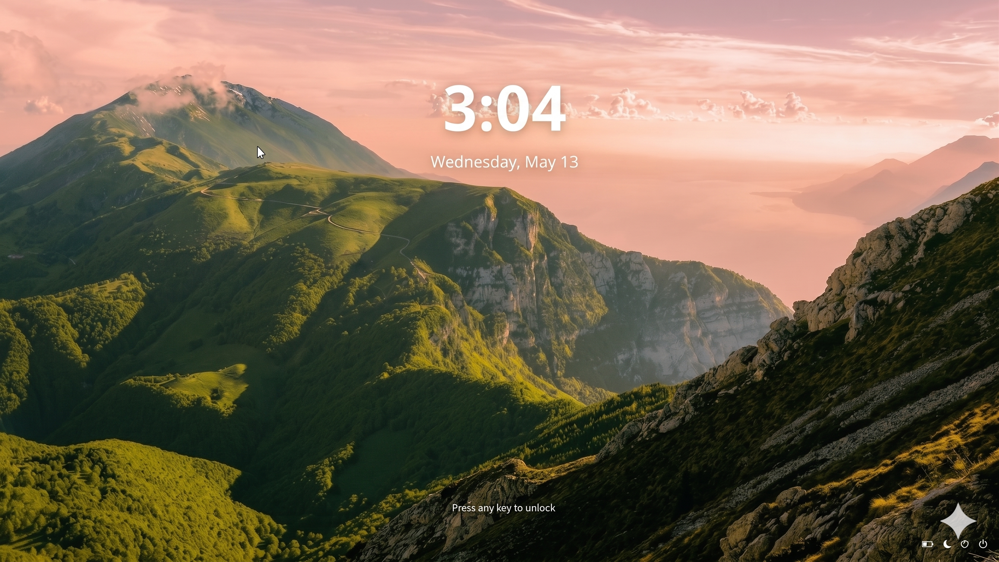
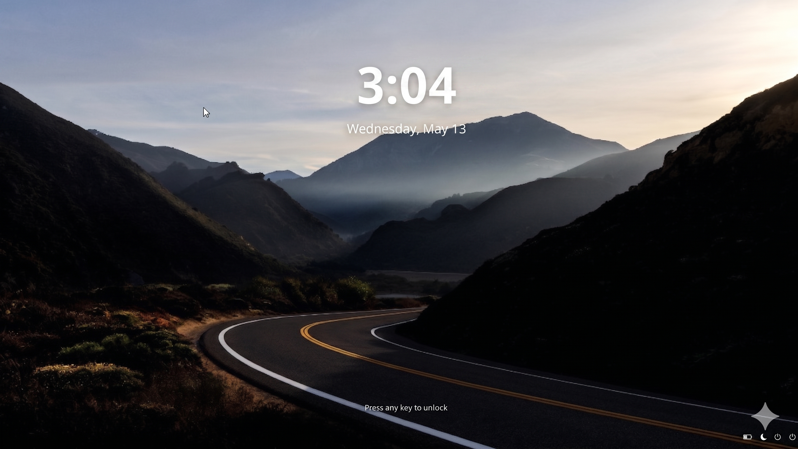
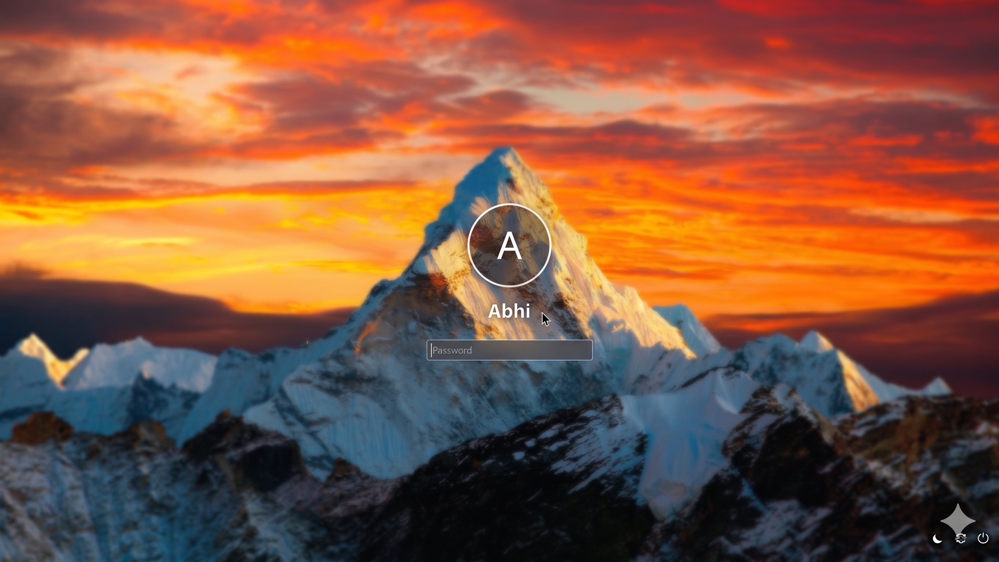
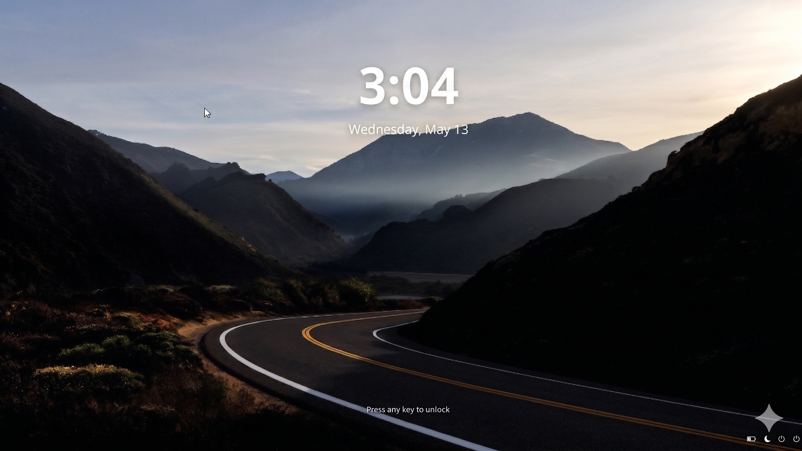

# Windows 11 SDDM Theme

A modern, clean, and elegant SDDM theme inspired by Windows 11. It features a beautiful glassmorphism UI, dynamic accent color extraction from wallpapers, and smooth transitions.



## Features

- **Windows 11 Visuals:** Modern UI with glassmorphism effects and clean typography.
- **Dynamic Accent Colors:** Automatically extracts and applies the dominant color from your wallpaper to UI elements.
- **Dynamic Backgrounds:** Support for multiple background images with random selection on each boot.
- **Glassmorphism:** Beautifully blurred backgrounds and semi-transparent panels using Qt6 MultiEffect.
- **Smooth Transitions:** Elegant fade and blur animations between the lock and login screens.
- **Clock & Date:** Large digital clock and date display on the lock screen.
- **User Selection:** Support for multiple users with avatar icons.
- **Session Selection:** Easily switch between different desktop environments.
- **Power Management:** Quick access to Suspend, Reboot, and Shutdown.
- **Battery Status:** Live battery percentage and charging status indicator.
- **Keyboard Layout:** Display and switch between keyboard layouts.
- **Customizable:** Easily configurable via `theme.conf`.

## Screenshots

### Lock Screen


### Login Screen


### Screenshot2


## Installation

### Automatic Installation

Run the included installation script with root privileges:

```bash
chmod +x install.sh
sudo ./install.sh
```

The script will:
1. Install the theme to `/usr/share/sddm/themes/win11sddm`.
2. Optionally set it as your current SDDM theme in `/etc/sddm.conf`.

### Manual Installation

1. Copy the project folder to the SDDM themes directory:
   ```bash
   sudo mkdir -p /usr/share/sddm/themes/win11sddm
   sudo cp -r . /usr/share/sddm/themes/win11sddm
   ```

2. Edit `/etc/sddm.conf` (or create a new file in `/etc/sddm.conf.d/`) and set the theme:
   ```ini
   [Theme]
   Current=win11sddm
   ```

## Configuration

You can customize the theme by editing `theme.conf`:

- `accentColor`: Manual accent color (if `autoColor` is false).
- `autoColor`: Set to `true` to enable automatic accent color extraction.
- `use24HourClock`: Toggle between 12h and 24h clock formats.
- `fontFamily`: Set your preferred font family.
- `fontSize`: Adjust the base font size.

## Requirements

- SDDM
- Qt6 (with QtQuick, QtQuick.Controls, QtQuick.Layouts, QtQuick.Effects)


